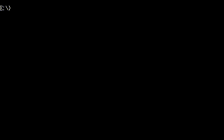
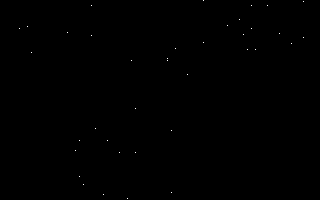

# DOS Stars

**Currently a work-in-progress : the implementation does not actually do what it is supposed to do yet**

[](https://travis-ci.com/OrangeTide/dos-stars)

[](http://creativecommons.org/publicdomain/zero/1.0/)

## Introduction

Displays a scrolling starfield in CGA on 16-bit realmode DOS.





## Building, Running, and Testing

### Prerequisites

 * [nasm](https://www.nasm.us/)
 * [DOSBox](https://www.dosbox.com/) or [Bochs](http://bochs.sourceforge.net/) or [PCem](https://pcem-emulator.co.uk/)

### Building

```
make
```

## Testing

(requires DOSBox)

```
make test
```

or

```
dosbox
```

Edit dosbox.conf to suit your platform configuration.

## Reference

 * [Vintage PC Pages - Color Graphics Adapter Notes](http://www.seasip.info/VintagePC/cga.html)
 * [Old Pseudo-Random Number Generators](http://orangeti.de/code/oldrand.c)
 * [8086 Cheat Sheet PDF](https://www.chibialiens.com/8086/8086CheatSheet.pdf)
